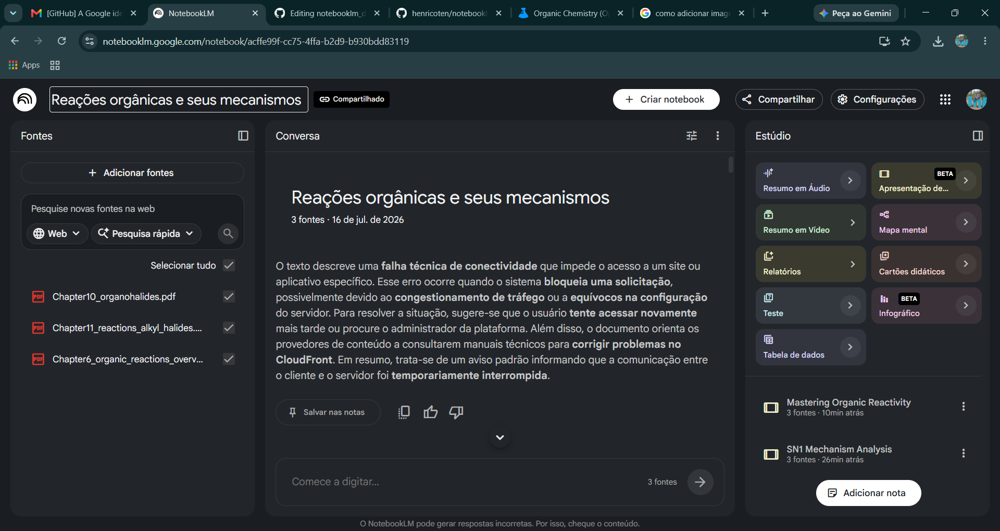
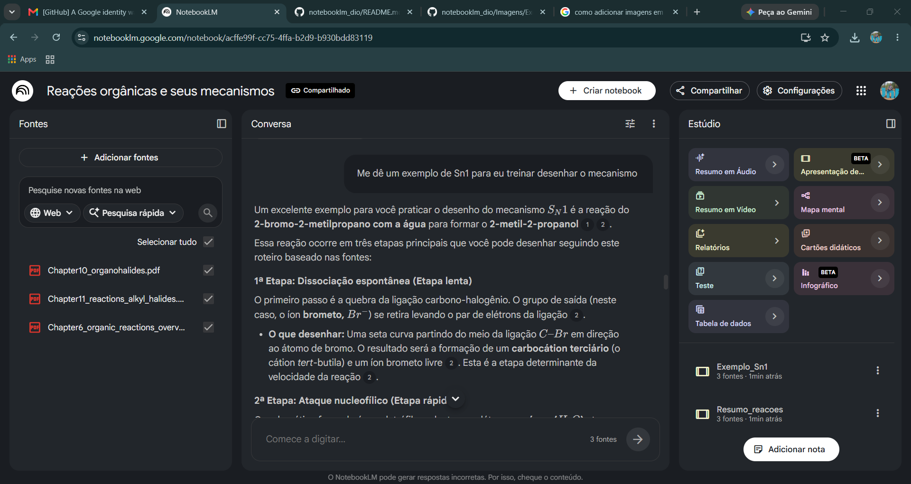
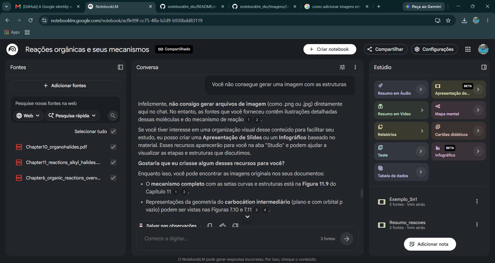

# Desafio de Projeto: Treinando uma IA de Aprendizagem - Explore o Poder do NotebookLM
* Autor: Henrique do Nascimento Coutinho
* GitHub: https://github.com/henricoten
* NotebookLM: https://notebooklm.google.com/notebook/acffe99f-cc75-4ffa-b2d9-b930bdd83119

**Contexto e objetivos**

Memória da criação de um NotbookLM para estudo das principais reações orgânicas envolvendo haletos de alquila (Sn1, Sn2, E1 e E2) para me auxiliar na preparação para a prova de seleção do mestrado em Química da PUC-Rio.

**Curadoria de fontes**

Utilizei como fontes capítulos específicos (6, 10 e 11) de um dos livros de química orgânica da Chemistry LibreTexts (https://chem.libretexts.org/Bookshelves/Organic_Chemistry/Organic_Chemistry_(OpenStax)) que tratam desse tipo de compostos orgânicos e suas reações além de conceitos básicos de reações orgânicas de forma geral.

**Engenharia de prompts e cicatrizes** 

A primeira dificuldade na geração desse notebook foi fornecer as fontes de pesquisa. O NotebookLM não foi capaz de recuperar os dados do livro diretamente pela URL (ver mensagem de erro abaixo), então eu baixei os capítulos de interesse e os forneci ao sistema na forma de 3 arquivos PDF separados.

Com as fontes preparadas, perguntei ao modelo quais são as principais reações orgânicas que envolvem haletos de alquila. A resposta foi muito mais completa do que eu imaginei, trazendo várias reações das quais eu sequer lembrava da existência (como a formação de compostos de Grignard).
Segui fazendo perguntas mais específicas das reações que eu gostaria de estudar, inclusive solicitando exemplos para eu treinar (ver exemplo abaixo).

Embora o exemplo gerado seja muito significativo, ele é puramente textual. Pedi então à IA que gerasse imagens estruturais das espécies químicas envolvidas. Como ela se mostrou incapaz de atender esse pedido (ver imagem abaixo) solicitei a criação de algumas apresentações de slide para suportar o estudo.

As apresentações geradas estão disponíveis tanto neste repositório (em formato PDF) quanto diretamente através da URL o notebook (https://notebooklm.google.com/notebook/acffe99f-cc75-4ffa-b2d9-b930bdd83119). 
